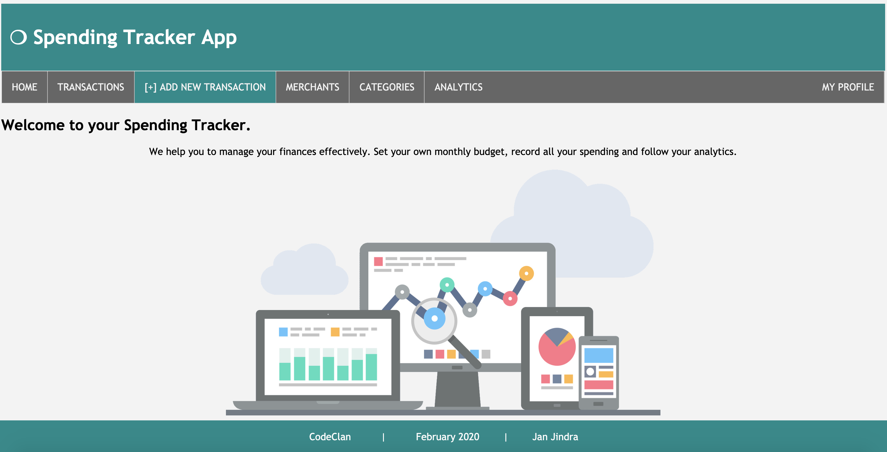

# Spending Tracker
## Week 5 Individual Project @ CodeClan
### ( 2020 - 2020)

Spending Tracker app allows you to track your own spending, given a set budget. It's designed to help you to manage your finances effectively. Set your own monthly budget, record all your spending and follow your analytics.

#### Set up / Running the project
###### Front-end:
* Reload the PSQL DB: psql -d spend_tracker -f db/spend_tracker.sql
* Load the seeds: ruby db/seeds.rb
* Exit the pry: !!!
* Start the Spending tracker app: ruby app.rb  
* The app will be running on the port 4567 (http://localhost:4567/)
* To stop running the Spending tracker app: Control+C 
###### Back-end (PostgresSQL):
* Command+T to open a new window in the terminal.
* To switch to the PSQL mode, type: sql
* To change the user: \c spend_tracker 
* You are now ready to run any SQL queries (put semicolon at the end of any query).

