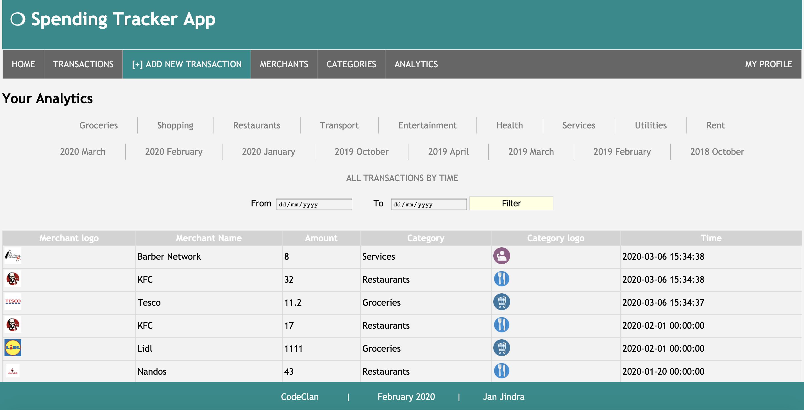

# Spending Tracker
## Week 5 Individual Project @ CodeClan
### ( Jan 31, 2020 - Feb 6, 2020)

Spending Tracker app allows you to track your own spending, given a set budget. It's designed to help you to manage your finances effectively. Set your own monthly budget, record all your spending and follow your analytics.

The project is built using only:
* HTML / CSS
* Ruby
* Sinatra (front-end)
* PostgreSQL and the PG gem (back-end)

## User interaction / journey
#### Set your budget
Navigate to "My Profile" in the navigation bar and click "Change Your Budget" to set your own monthly budget per spending category (grocery, entertainment, health etc). Save the details and your total monthly budget gets calculated.

#### Add a transaction
Record each of your expenditure to the application via the "Add new transaction" button in the navidation bar. Fill out the merchant's name (e.g. Tesco), the spending category (e.g. grocery), the amount spent (e.g. £20) and click submit.

#### Review all yout transactions / merchants / spending categories
You can add, remove and update transactions, merchants and spending categories in their respective tab in the navidation bar.

#### Analytics
The Analytics tab in the navigation bar allows you to see your transactions based on numerous filters that you can select from. You can view all your transactions ever made for each spending category individually, for each month-year combination individually, you can view all your transactions by time, and you can also see all transactions that fall into your selected date range. At the bottom of these lists, the application reminds you of your total monthly budget, your total spent based on the chosen filter method, and it also gives a message that compares your spending with your set budget.

## Project Brief (as given by CodeClan):
Build an app that allows a user to track their spending.

###### Minimum Viable Product requirements (MVP):
The app should allow the user to create and edit merchants, e.g. Tesco, Amazon, ScotRail
The app should allow the user to create and edit tags for their spending, e.g. groceries, entertainment, transport
The user should be able to assign tags and merchants to a transaction, as well as an amount spent on each transaction.
The app should display all the transactions a user has made in a single view, with each transaction’s amount, merchant and tag, and a total for all transactions.

###### Inspired by:
Monzo, MoneyDashboard, lots of mobile/online banking apps

###### Possible Extensions
The user should be able to mark Merchants and Tags as deactivated. Users will not be able to choose deactivated merchants/tags when creating a transaction.
Transactions should have a timestamp, and the user should be able to view transactions sorted by the time they took place.
The user should be able to supply a budget, and the app should alert the user somehow when when they are nearing this budget or have gone over it.
The user should be able to filter their view of transactions, for example, to view all transactions in a given month, or view all spending on groceries.

#### Set up / Running the project
###### Front-end:
* Reload the PSQL DB: psql -d spend_tracker -f db/spend_tracker.sql
* Load the seeds: ruby db/seeds.rb
* Exit the pry: !!!
* Start the Spending tracker app: ruby app.rb  
* The app will be running on the port 4567 (http://localhost:4567/)
* To stop running the Spending tracker app: Control+C 
###### Back-end (PostgresSQL):
* Command+T to open a new window in the terminal.
* To switch to the PSQL mode, type: sql
* To change the user: \c spend_tracker 
* You are now ready to run any SQL queries (put semicolon at the end of any query).

